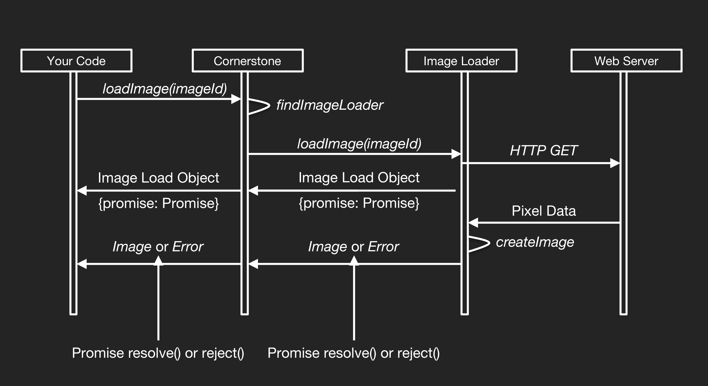

# Image Loaders
* `Image Loaders(图像加载器)` 实际上是一个 js 函数，函数的主要功能就是获取/解析 `Image Id`，并对象的形式返回解析结果。`Image Loaders` 返回一个 包含图像对象的 Promise 对象
* 由于解析图像需要调用服务器，所以图像加载的过程是一个异步的过程。


## Image Loaders 加载图像的工作流程


1. 在 Cornerstone 初始化时，根据图像的类型注册对应的 Image Loader(图像加载器);
2. 调用 `loadeImage(ImageId)` API 加载图像;
3. Cornerstone 将加载图像的请求通过 `loadeImage(ImageId)` 委托给注册的图像加载;
4. `ImageLoader` 解析完成之后会返回一个包含 图像加载对象的 Promise 对象，一旦获取到像素数据，加载器会使用对应的图像对象来解析该 Promise。像素数据需要在服务器端进行解压缩，转换然后传递给前端。
5. 最后调用 `displayImage()`API 来显示解析好的图像

*虽然像素数据通常是从服务端获取的，但是并不是必须要从服务器端获取像素数据，实际上使用ImageLoader插件来解析图像根本不需要服务器。base64格式的图像可以存储在ImageLoader插件中，ImageLoader插件只是将base64的像素数据转换为像素数组。我们还可以通过编写一个图像加载器，在客户端生成派生图像（通过这种方式可以实现 MPR）*

## 常用的图像加载器
|ImageLoader|用途|
| --- | --- |
|Cornerstone WADO Image Loader| * DICOM Part 10 images(符合DICOM Part 10 格式的医学影像图片) <br> * Supports multi-frame DICOM instance（支持 WADO-URI 和 WADO-RS 格式的医学影像图片） <br> * Supports reading DICOM files from the File objects(支持从文件对象中读取 DICOM 文件) |
|Cornerstone Web Image Loader|* PNG and JPG images(PNG 和 JPG 格式的图片)|

## Image Load Object (图像加载对象)
* Cornerstone Image Loader 返回一个包含图像加载对象的Promise 对象
* 选用 Promise 对象包装图像对象是因为，图像加载对象还可以返回加载器对象中其他属性

## 如何编写一个 Image Loader
```javascript
function lodaImage(imageId) {
    const url = parseImageId(imageId);
    const promise = new Promise((resolve, reject) => {
        const oReq = new XMLHttpRequest();
        oReq.open('get', url, true);
        oReq.responseType = 'arraybuffer';
        oReq.onreadystatechange = function (event) {
            if(oReq.readyState === 4) {
                if(oReq.state === 200) {
                    const image = createImageObject(oReq.response);
                    resolve(image);
                } else {
                    reject(new Error(oReq.statusText));
                }
            }
        }
    })

    return { promise }
}
```

* Image Loader 返回解析后的图像加载对象, 当图像对象被解析完成之后，会resole解析完成的 `image` 对象
* 使用 `RegisterImageLoader()` API 注册图像加载器

```javascript
// 注册图像加载插件
cornerstone.registerImageLoader('myCustomLoader', loadImage);
// 调用图像加载器解析图像
cornerstone.loadImage('myCustomLoader://example.com/image.dcm');
```
