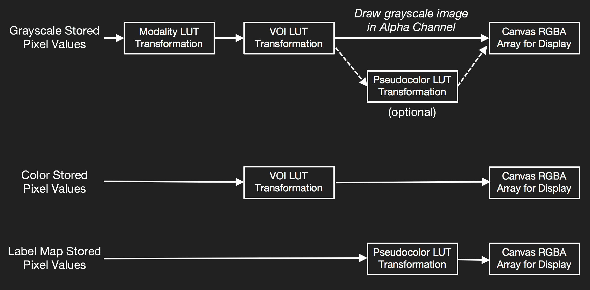

# Rendering Pipeline (渲染管线)
*Cornerstone 可以根据图像的类型(灰度图像、彩色图像、标签图像、和视口伪彩色图像)选择最合适的渲染管道来进行渲染，这样可以确保每种类型的图像都能以最佳的方式显示在屏幕上*
* `Image rendering pipeline`: 图像渲染管道是指一系列的渲染步骤和算法，用于将图像数据转化为可以显示在屏幕上的像素
* `Image type`: 图像类型，指图像的不同类型，例如灰度图像、彩色图像、标签图像和视口伪彩色图像。每种类型的图像都能以最佳的方式显示在屏幕上。
***
## 渲染管线的工作流程

| rendering path 渲染路径| 渲染路径描述 |
| -- | -- |
| **renderGrayscaleImage**     **灰度图像的默认渲染管道** | * 用于将灰度图像渲染到屏幕上   * 在灰度图像中，像素值只包含亮度信息，没有颜色信息   * 渲染管道中包括 Modality LUT 转换 和 VOI LUT 转换   * Modality LUT 转换是指将图像从一种模态(CT、MRI)转换成标准模态的过程   * VOI(Volume of Interst) LUT 转换用于调整特定区域或感兴趣区域的图像亮度或对比度 |
| **renderPseudoColorImage**    **将灰度图像转化为彩色图像来增强图像的可读性和视觉效果** | * 当 Viewport colormap 属性被设置时使用。它将在 modality LUT 转换和 VOI LUT 转换之后，将 Pseudocolor LUT transformation(伪彩色LUT转换)应用与像素数据   * Modality LUT and VOI LUT transformations 用于调整图像的亮度和对比度   * Pseudocolor LUT transfotmation(伪彩色LUT转换)是一种将像素值映射到伪彩色调色板的过程，以在视口中显示图像 | 
| **renderWebImage**    **彩色图像默认渲染管道，用于处理和显示彩色图像的标准流程或方法** | * Image 对象的rgba属性设置为true，否则所有像素的 alpha(不透明度保持不透明)   * 在图像处理中,alpha 用于控制像素的不透明度，范围从完全透明（0%）到完全不透明（100% |
| **renderLabelImage**    **用于将标签图像渲染为可视化的结果** | * 在医学图像处理中，标签图像通常是指将感兴趣的区域或结构进行标注和分类的图像   * Pesudocolor LUT transform 直接应用于图像中存储的原始像素数据，不会应用 modality LUT 或者 VOI 转换   * 通 Pesudocolor LUT transform  可以将灰度或者标签值转换为彩色，以便于区分和是实话不同的标签或区域 | 

## 各个渲染管线的主要渲染步骤
1. **`renderGrayscaleImage 渲染管线:**
    * *源图像加载*: 加载需要渲染的彩色图像
    * *颜色空间转换*: 将彩色图像从 RGB 颜色空间转换为灰度颜色空间。在灰度颜色空间中，每个像素只有一个亮度值，而不是三个 颜色通道(红、绿、蓝)
    * *亮度计算与映射*: 根据转换后的灰度值，计算每个像素的亮度，可以使用不同的算法来计算像素的亮度，如加权平均法、最大值法等。
    * *渲染合成*: 根据计算出的亮度值，将像素渲染为灰度图像。这一步通常涉及将亮度值映射到特定的灰度级别。并可能进行一些后处理操作，如平滑滤波、对比度增强等。
    * *输出显示*: 最后将渲染后的灰度图像显示出来

*renderGrayscaleImage 渲染管线在需要快速处理和显示灰度图像的场景中非常有用，例如在医学影像分析、安全监控等领域。通过将彩色图像转换为灰度图像，可以减少计算的复杂性和存储需求，与此同时还能提供有用的信息* 

2. **renderPseudoColorImage 渲染管线:**
    * *源图像加载*: 加载需要渲染的灰度图像
    * *灰度值范围调整*: 如果需要，调整灰度值的范围以适应伪彩色映射，这通常涉及将 灰度值归一化到特定的范围，以便更好的进行颜色映射
    * *伪彩色映射*: 将调整后的灰度值映射到与定义的伪彩色调色板上。这个调色板通常包含一系列的颜色，这些颜色在视觉上可以区分不同的灰度级别
    * *颜色合成*: 根据映射的结果，将每个像素的颜色进行合成，以生成最终的伪彩色图像。这通常涉及将灰度值映射到相应的颜色，并进行必要的后处理操作，如平滑滤波、对比度增强
    * *输出显示*: 最后将渲染的伪彩色图像显示出来

*renderPesudoColorImage 渲染管线在处理和分析灰度图像时非常有用。通过将灰度图像转化为彩色图像，可以更容易识别和区分不同的灰度级别，从而提高图像的可读性和视觉效果。这种渲染管线在许多领域中都有应用（一些影像分析、遥感图像处理、地址勘探）*
    
3. **renderColorImage 渲染管线:**
    * *加载图像*: 加载要渲染的图像（读取图像文件并将图像加载到内存中）
    * *预处理*：在正式渲染之前，可能需要进行一些预处理操作，如图像缩放、裁剪、格式转换等。这些操作可能有助于提高渲染质量和效率。
    * *颜色空间转换*：在预处理阶段之后，可能需要进行颜色空间转换。这可能涉及将图像从RGB颜色空间转换为其他颜色空间，如CMYK或HSV。这种转换可能有助于优化图像的渲染效果。
    * *几何变换与光栅化*：在这一阶段，图像中的几何形状（如三角形、多边形等）将被变换和投影到屏幕上。这些变换可能包括平移、旋转、缩放等操作，以实现所需的视觉效果。然后，几何形状被光栅化成像素，并为每个像素计算颜色值。
    * *后处理与合成*: 后处理阶段可以对渲染结果进行进一步的处理和增强，如抗锯齿处理、景深效果、颜色校正等。这些操作可以提高图像的视觉效果和逼真度。最后，所有像素被合成并渲染成最终的彩色图像。
    * *输出显示*: 最后，渲染完成的彩色图像被输出到显示设备上

*renderColorImage 渲染管线是一个相对复杂的流程，涉及多个步骤和计算密集型操作。为了实现高效的渲染，通常需要使用高性能的图形处理器（GPU）来加速这些计算。通过合理的优化和并行化处理，现代GPU可以显著提高渲染速度并实现高质量的彩色图像输出*

4. **renderLabelMapImage 渲染管线:**
    * *加载标签映射图像*：首先，需要加载包含标签信息的图像。标签映射通常是一个二值图像，其中每个像素被赋予一个标签值，表示该像素属于特定的区域或对象。
    * *标签颜色映射*：根据标签值，将每个像素映射到一个特定的颜色。通常，不同的标签值对应不同的颜色，以便在渲染时能够清晰地区分不同的区域。
    * *渲染合成*：根据颜色映射的结果，将每个像素的颜色值进行合成，以生成最终的可视化图像。这一步可能涉及一些后处理操作，如平滑滤波、对比度增强等，以提高图像的可读性和视觉效果。
    * *输出显示*：最后，将渲染后的标签映射图像显示出来，供用户查看和分析

*renderLabelMapImage 渲染管线在医学影像分析、遥感图像处理等领域中非常有用。通过将标签映射可视化，研究人员和分析人员可以更直观地了解图像内容，并识别和分析不同的区域或对象。这种渲染管线有助于提高图像处理的效率和准确性，并促进更好的决策和诊断。*