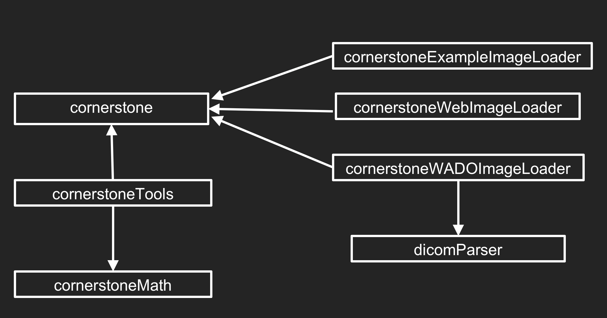

# 医学影像平台开发库
**Cornerstone 是一个开源项目，目标是提供一个完整的基于网络的医学成像平台。它提供了可以一起或独立使用的模块化库**

*Cornerstone Core 是 Cornerstone 生态的核心库，是负责图像渲染管线、图像的加载和缓存、视口变化的库*

## Cornerstone 生态
|库|简介|
|--|--|
|**Cornerstone Core**|提供图像渲染、图像加载、缓存和视口变换的核心库：  * **图像渲染:** 将图像数据转化为可以在屏幕上显示的像素的过程   * **图像加载:** 从服务器或者其他地方获取图像数据   * **缓存:** 为了提高性能，以及加载过的图像可以被存储在本地，以便在需要时快速加载   * **视口变化:** 当用户与图像交互(缩放、平移或旋转)时,cornerstone core 会处理这些交互带来的视觉上的变化，确保图像始终能够清晰、正确的显示|
|**Cornerstone Tool**|* Cornerstone Tools 提供了一些基础工具类，主要用于医学图像的注释、分割和测量   * BaseTool 是所有工具的顶级分类。这个类负责初始化工具的配置、应用 mixin, 并为激活状态的工具有效的鼠标/触摸交互提供虚拟函数   * Cornerstone Tool 还可以响应各种事件，如鼠标按下、鼠标滚轮或按键事件，可以在图像上绘制图形和文本   * 使用 Cornerstone Tool 库还需要依赖一些外部的库，如 jquery、cornerstone 和 hammer |
|**Cornerstone WADO Image Loader**|* DICOM Part 10 文件的图像加载器   * 允许开发者指定图像的加载策略，缓存设置以及如何处理图像的加载和错误|
|**Cornerstone Web Image Loader**|* Web 图像文件(PNG、JPEG)的图像加载器|
|**Cornerstone Math**|* 用于处理数学和几何运算的 js 库   * 为开发人员提供了一些函数和工具，用于执行常见的数学和几何操作，如向量计算、矩阵计算、四元运算等   * 这个库的目的是为 Cornerstone 生态系统提供数学支持，确保开发人员能够使用一致的数学和函数工具，以简化医学图像处理和可视化中的计算过程   * 通过使用 Cornerstone Math 开发人员可以更加轻松地处理图像坐标、变换和几何形状的计算，从而提高医学图像处理和可视化的准确性和效率|
|**dicomParser dicom**|* 用于解析 DICOM 格式的文件   * dicomParser dicom 库提供了一种简单的方式来解析DICOM文件，将他们转换为 js 对象，以便在web应用程序中进行处理和显示   * dicomParset dicom 支持绝大多数DICOM 标准，包括常见的图像元数据、序列和解剖结构等|

